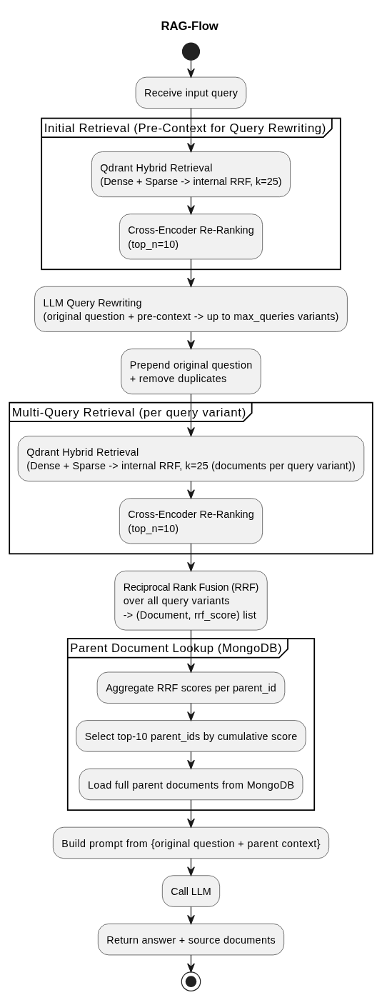

# RAG Pipeline



The pipeline runs through five stages for every incoming question. The orchestration lives in `rag_core/pipeline.py`.

## 1. Initial retrieval (pre-context for query rewriting)

Before the LLM generates query variants, the pipeline runs one retrieval pass with the raw question. This gives the LLM a picture of what is actually in the knowledge base, which leads to better query variants.

The retrieval works the same as in the multi-query step below: Qdrant hybrid search (k=25) followed by cross-encoder reranking (top 10). The reranked results are passed to the LLM as `pre_context`.

## 2. LLM query rewriting

The LLM receives the original question and the pre-context and generates up to `max_queries` (default 5) diverse search query variants. It also classifies the question as `"code"` or `"document"` and applies different rewriting strategies accordingly:

- **Code:** function/class signatures, docstring phrasing, import statements, variable names, error messages, code patterns, test examples
- **Document:** direct rephrasing, keyword extraction, concept queries, mechanism and cause queries, domain-specific terminology, alternative perspectives

After generation, the original question is prepended as the first query and duplicates are removed. This means a failed LLM call still produces one working query and keeps the original question.

## 3. Multi-query retrieval

For each query variant, two steps run in sequence:

**Qdrant hybrid search** - each chunk is indexed with two embedding types. Dense embeddings (external model, OpenAI-compatible endpoint) capture semantic similarity. Sparse BM25 embeddings (FastEmbed `Qdrant/bm25`, runs locally) capture exact keyword matches. Qdrant fuses both scores internally with its own RRF before returning the top k=25 chunks. This combination is effective for domain-specific terms like class names and abbreviations that dense models tend to underweight.

**Cross-encoder reranking** - a local model (`cross-encoder/ms-marco-MiniLM-L-6-v2`) re-scores the 25 candidates by reading each query–chunk pair together, rather than scoring them independently as the search step does. The top 10 per query are kept.

## 4. Reciprocal Rank Fusion across query variants

The per-query result lists (up to 5 lists of 10 chunks each) are merged with RRF. Each document's score is:

```
score = Σ  1 / (rank_i + k)
```

summed over all result lists the document appears in, with k=60. Documents that rank highly across multiple query variants score higher. This is a second RRF on top of Qdrant's internal one - Qdrant fuses dense and sparse scores per query, then this fuses per-query results across all query variants.

## 5. Parent document lookup

After RRF, scores are aggregated per unique `parent_id`. The top 10 parent IDs by cumulative RRF score are looked up in MongoDB.

## 6. Answer generation

A prompt is built from the original question and the fetched parent sections. The LLM generates the answer restricted to the provided context. The response includes the answer text and the source file paths of the retrieved sections.

The system prompt is in `rag_core/pipeline.py`. The query rewriting strategies are in `rag_core/query_rewrite.py`. Both should be updated when adapting the pipeline for a new domain.

## Metrics

Every request tracks token counts and latency per phase: initial retrieval, query rewriting, multi-query retrieval (including reranking), parent fetch, and answer generation. The breakdown is logged to stdout and written asynchronously to a `request_metrics` MongoDB collection.
